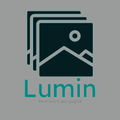

<h1 align="center">
  <br>
  <!-- Add lumin img -->
  
<!--   <br>
  Lumin -->
  <br>
</h1>

<h4 align="center">Animated background manager made with <a href="http://rust-lang.org" target="_blank">Rust</a>.</h4>

<p align="center">
  <a href="#key-features">Key Features</a> •
  <a href="#how-to-use">How To Use</a> •
  <a href="#download">Download</a> •
  <a href="#credits">Credits</a> •
  <a href="#related">Related</a> •
  <a href="#license">License</a>
</p>

TODO: Add simple demo video
./assets/demo.mp4

## Key Features

* Display any video as your desktop background
* Video download
  - Download videos from youtube
* Dark/Light mode


## How To Use

### TODO

## Download

### Installer
TODO: Make a page on bowarc.ovh
You can download the installer [here](https://github.com/Bowarc/lumin) 

### Manual installation
To clone and run this application, you'll need [Git](https://git-scm.com) and [Rust](https://rust-lang.org/)

```bash
# Clone this repository
$ git clone https://github.com/Bowarc/lumin

# Go into the repository
$ cd lumin

# Run the app
$ ./scripts/run.sh
```

> **Note**
> Due to Windows limitations, you may need to add "workerw_fetcher.exe" to your AV's whitelist 

## Credits

This software uses the following open source packages:

<!-- - [egui](http://docs.rs/egui) -->
<!-- - [egui-notify](https://docs.rs/egui-notify) -->

## Related

[weebp](https://github.com/Francesco149/weebp) - More developper oriented version of lumin

## You may also like...

- [Painter](https://github.com/bowarc/painter) - A simple programm that allows you to draw on your screen
- [chess_game](https://github.com/bowarc/chess_game) - A multiplayer chess game

## License

TODO

---

> [Bowarc.ovh](https://www.bowarc.ovh) &nbsp;&middot;&nbsp;
> GitHub [@Bowarc](https://github.com/Bowarc) &nbsp;&middot;&nbsp;
> Twitter [@bowarc_](https://twitter.com/bowarc_) &nbsp;&middot;&nbsp;
> Discord @Bowarc

